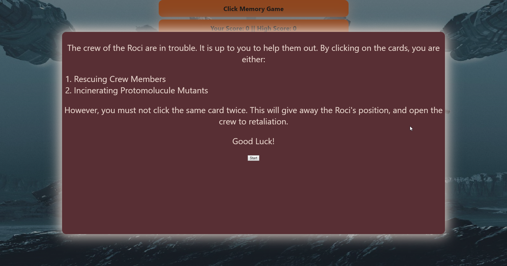

This project was bootstrapped with [Create React App](https://github.com/facebook/create-react-app).

**Note: If you would like to see a demo, go here: https://brantkeener.github.io/Backend-Demos/**

# Clicky-Game
*A react memory app that requires the user to click unique pictures.*

**Clicky-Game** is a memory card game based on the excellent science fiction series [The Expanse](https://www.imdb.com/title/tt3230854/). If you haven't started watching it yet, check it out on Amazon Prime!
The user is immediately greeted with a modal that gives them a rundown on how to play the game.

## Motivation

Creating **Clicky-Game** allowed for an initial exposure to React, and state, and how to interact with both.

## Build Status

Complete

## Code Style

Standard

## Demo

In addition, when win (12 cards correctly guessed), or loss (a card is picked twice) conditions are met, the user will be greeted with a gif as demonstrated below:

*Win Gif*

*Loss Gif*

## Tech/framework Used

Built utilizing React!

## Features

Clicky-Game features a fun card-flipping animation with rich backgrounds, and a color palette derived from the universe of The Expanse. All cards are related to the show's characters, with gifs pulled from [Giphy](https://giphy.com/) to help give the app an even more game-like feel. The game monitor's user's current and high schores for this session. The app also montiors the cards such that if a duplicate card is chosen, a loss condition is thrown, while if 12 correct cards are chosen wihtout duplication, a win condition is thrown.

## Installation

Perform either a clone or a fork by visiting [Clicky-Game](https://github.com/BrantKeener/Clicky-Game). This will give you access to everything you need.

## How to Use

Play the Game: All you need to do to play the game is head over to [The Expanse Clicky-Game](https://brantkeener.github.io/Clicky-Game/).
Develop: Perform the above installation instructions.

## Credits

Written and maintained by Brant Keener.
